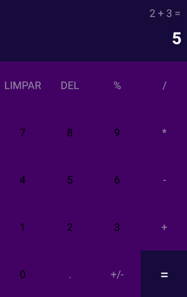

<html>
  <h1>ProjetoCalculadora</h1>
  <h2>Descrição</h2>
  
Projeto de Calculadora com react native para Android com principais comandos de soma, subtração, multiplicação e divisão, além de ter implementado comando de alterar sinal (+/-) e porcentagem (%), bem como funções de deletar e limpar.

  
Aplicativo criado na versão 0.63.3 do react native, porém também funciona em versões posteriores a essa.

  <h2>Requisitos</h2>
  <ul>
    <li>React Native;</li>
    <li>Virtual Box;</li>
    <li>Emulador (Genymotion, Android Studio, entre outros);</li>
    <li>Node.js;</li>
    <li>Visual Studio Code;</li>
  </ul>
  <h2>Captura de Tela</h2>
  

    
  

  <h2>Status do Projeto</h2>
  
Projeto finalizado!

</html>
